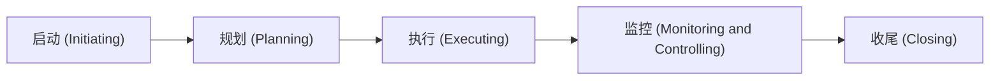

项目管理是职场人士必备技能。在PMBOK® Guide中对项目的定义是“a temporary endeavor undertaken to create a unique project service or result. 项目是为创造独特的产品、服务或成果而进行的临时性工作。”。
在现实中，任何事情都可以当作一个项目来执行，因此具备项目管理技能以及拥有项目管理思维对每个人都很重要。

PMBOK Guide帮助总结了项目管理的5大过程组 (Process Group)、10大知识领域 (Knowledge Area)和49个流程定义 (Process)，是项目管理知识和实践的高度总结。

## **5大过程组 (Process Group)：**

启动 (Initiating) --> 规划 (Planning) --> 执行 (Executing) --> 监控 (Monitoring and Controlling) --> 收尾 (Closing)

## **10大知识领域 (Knowledge Area)**
1. 项目整合管理 (Project Integration Management)
2. 项目范围管理 (Project Scope Management)
3. 项目进度管理 (Project Schedule Management)
4. 项目成本管理 (Project Cost Management)
5. 项目质量管理 (Project Quality Management)
6. 项目人力资源管理 (Project Human Resources Management)
7. 项目沟通管理 (Project Communications Management)
8. 项目风险管理 (Project Risk Management)
9. 项目采购管理 (Project Procurement Management)
10. 项目干系人管理 (Project Stakeholder Management)

## **49个流程定义 (Process)**

每个知识领域都需要依照5大流程组顺序进行，流程组也就是我们在项目管理中经常提到的项目阶段(Phase)，即每个知识领域都需要具备5个阶段。在每个阶段中，针对每个知识领域PMBOK Guide定义了不同的流程(Process)指导具体的执行。

因此，5大流程组、10大知识领域和49个流程定义组成的矩阵结构形成了项目管理的最佳实践(Best Practice)。

&nbsp;                                          | P1. 启动 (Initiating)                          | P2. 规划 (Planning)                                                                                                                                                                                                                                                    | P3. 执行 (Executing)                                                                                                       | P4. 监控 (Monitoring and Controlling)                                                                                | P5. 收尾 (Closing)
----------                                      |----------                                          |----------                                                                                                                                                                                                                                                                 |----------                                                                                                                     |----------                                                                                                                |----------
1. 整合管理 (Integration Management)         | <a name="1-P1">1. Develop Project Charter</a>      | <a name="1-P2">3. Develop Project Management Plan</a>                                                                                                                                                                                                                     | <a name="1-P3-1">27. Direct and Manage Project Work</a> <a name="1-P3-2">28. Manage Project Knowledge</a>                 | <a name="1-P4-1">37. Monitor and Control Project Work</a> <a name="1-P4-2">38. Perform Integrated Change Control</a> | <a name="1-P5">49. Close Project or Phase</a>
2. 范围管理 (Scope Management)               |                                                    | <a name="2-P2-1">4. Plan Scope Management</a> <a name="2-P2-2">5. Collect Requirements</a> <a name="2-P2-3">6. Define Scope</a> <a name="2-P2-4">7. Create WBS</a>                                                                                            |                                                                                                                               | <a name="2-P4-1">39. Validate Scope</a> <a name="2-P4-2">40. Control Scope</a>                                       | 
3. 进度管理 (Schedule Management)            |                                                    | <a name="3-P2-1">8. Plan Schedule Management</a>  <a name="3-P2-2">9. Define Activities</a>  <a name="3-P2-3">10. Sequence Activities</a>  <a name="3-P2-4">11. Estimate Activity Durations</a>  <a name="3-P2-5">12. Develop Schedule                    |                                                                                                                               | <a name="3-P4">41. Control Schedule</a>                                                                                  |  
4. 成本管理 (Cost Management)                |                                                    | <a name="4-P2-1">13. Plan Cost Management</a> <a name="4-P2-2">14. Estimate Costs</a> <a name="4-P2-3">15. Determine Budget</a>                                                                                                                                   |                                                                                                                               | <a name="4-P4">42. Control Costs</a>                                                                                     | 
5. 质量管理 (Quality Management)             |                                                    | <a name="5-P2">16. Plan Quality Management</a>                                                                                                                                                                                                                            | <a name="5-P3">29. Manage Quality</a>                                                                                         | <a name="5-P4">43. Control Quality</a>                                                                                   | 
6. 人力资源管理 (Human Resources Management)  |                                                    | <a name="6-P2-1">17. Plan Resource Management</a> <a name="6-P2-2">18. Estimate Activity Resources</a>                                                                                                                                                                | <a name="6-P3-1">30. Acquire Resources</a> <a name="6-P3-2">31. Develop Team</a> <a name="6-P3-3">32. Manage Team</a> | <a name="6-P4">44. Control Resources</a>                                                                                 | 
7. 沟通管理 (Communications Management)      |                                                    | <a name="7-P2">19. Plan Communications Management</a>                                                                                                                                                                                                                 | <a name="7-P3">33. Manage Communications</a>                                                                                   | <a name="7-P4">45. Monitor Communications</a>                                                                           | 
8. 风险管理 (Risk Management)                |                                                    | <a name="8-P2-1">20. Plan Risk Management</a> <a name="8-P2-2">21. Identify Risks</a> <a name="8-P2-3">22. Perform Qualitative Risk Analysis</a> <a name="8-P2-4">23. Perform Quantitative Risk Analysis</a> <a name="8-P2-5">24. Plan Risk Responses</a> | <a name="8-P3">34. Implement Risk Responses</a>                                                                                | <a name="8-P4">46. Monitor Risks</a>                                                                                    | 
9. 采购管理 (Procurement Management)         |                                                    | <a name="9-P2">25. Plan Procurement Management</a>                                                                                                                                                                                                                        | <a name="9-P3">35. Conduct Procurements</a>                                                                                    | <a name="9-P4">47. Control Procurements</a>                                                                             | 
10. 干系人管理 (Stakeholder Management)      | <a name="10-P1">2. 10-P1 Identify Stakeholders</a> | <a name="10-P2">26. Plan Stakeholder Engagement</a>                                                                                                                                                                                                                       | <a name="10-P3">36. Manage Stakeholder Engagement</a>                                                                          | <a name="10-P4">48. Monitor Stakeholder Engagement</a>                                                                   | 
