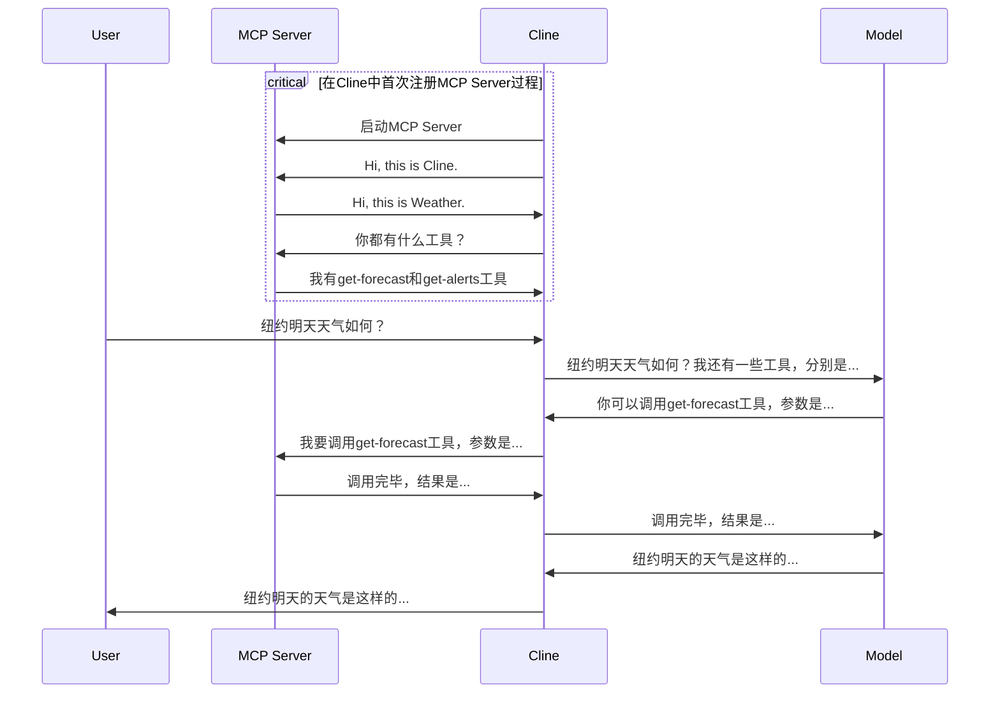

随着AI技术的快速发展，越来越多的名词铺天盖地地涌现出来，让我这个IT老兵一时无法适从。由于年龄和国内环境的原因，我从一个土生土长的程序员被推到了技术管理岗位，自然也多年没有接触太多代码工作。对于AI也是观望而已，最多也是使用公司的AI工具进行简单的办公效率提升的事情，比如搜索、翻译、帮助写一下PPT之类的基本工作，并没有深入研究，也甚至产生了躺平的念头。

2005年春节放假回来，突然国内被DeepSeek的事情搅动起来，公司在各级管理层会议上非AI不讨论的地步，做社么都尽可能跟AI沾点边。突然我也有了危机感，平时瞧不上的某些人也张嘴闭嘴Promopt, ChatGPT，LLM之类的夸夸其谈了，顿时让我也感到了危机，深感如果不了解AI可能会很快被淘汰。所以也平时刻意去了解一些AI的知识。

MCP是最近听说最多的新名词之一，在油管上看了一个简短的视频觉得很有启发意义，特别是对于我这种AI小白的人来说，言简意赅，所以就总结了其中的精华，作者以一个示例图阐述了整个交互过程，在此分享。

MCP是为AI模型推理提供标准化的上下文交信息互协议。我们大致可以用电脑和显示器的连接方式来做类比解释。
- 我们会使用各种连接线来连接电脑和显示器，比如符合HDMI, DP，MINI-DP，USB-A/B/C和其它接口协议的连接线，这些连接方式都能够达到最终效果，但如果不同的显示器和电脑有时候会仅支持某种或某一两种接口规范，有时候我们不得不购买支持较多接口规范的中间适配器（Adaptor）。
- MCP就类似与适配器，在客户端和AI模型之间建立了一个统一的规范，对于客户端来讲，可以通过统一的入口使用到各种不同的AI能力。

下面的流程图就阐述了整个交互过程。（备注：Cline是Code Agent工具, MCP Server - 以weather服务为例）

