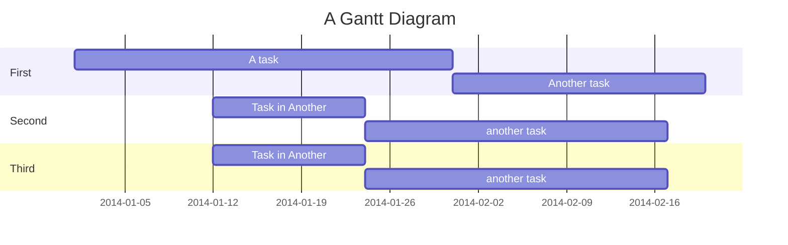
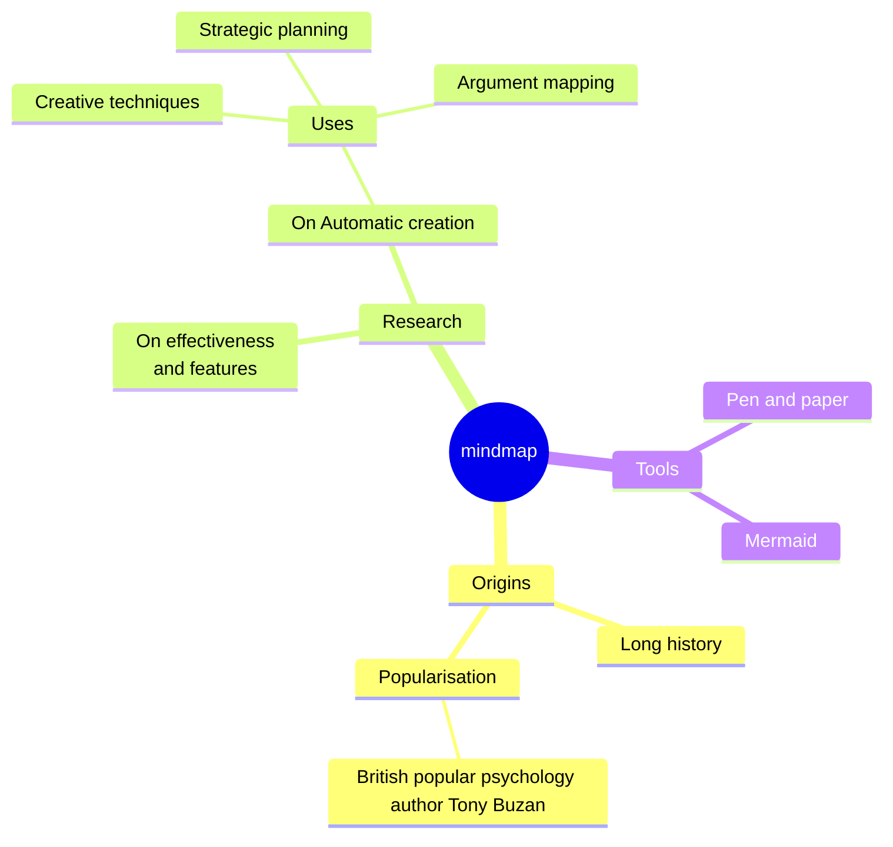

## Gantt Diagram

```mermaid
---
Title: Gantt Diagram
--- 

%%{init: {"theme": "default","logLevel": "info", "htmlLabels": true, "curve": "natural", "useMaxWidth": true}}%%

gantt
    title A Gantt Diagram
    dateFormat YYYY-MM-DD
    section First
        A task          :a1, 2014-01-01, 30d
        Another task    :after a1, 20d
    section Second
        Task in Another :2014-01-12, 12d
        another task    :24d
    section Third
        Task in Another :2014-01-12, 12d
        another task    :24d
```

## Mindmap Diagram

```mermaid
---
Title: Mindmap Diagram
--- 

%%{init: {"theme": "default","logLevel": "info", "htmlLabels": true, "curve": "natural", "useMaxWidth": true }}%%

mindmap
  root((mindmap))
    Origins
      Long history
      ::icon(fa fa-book)
      Popularisation
        British popular psychology author Tony Buzan
    Research
      On effectiveness<br/>and features
      On Automatic creation
        Uses
            Creative techniques
            Strategic planning
            Argument mapping
    Tools
      Pen and paper
      Mermaid

```